# Tiling - 1 April to 31 May

A trial layout, to see how the diagonal pattern would intersect with the drain and walls.  The broken pieces to the left are my attempt to cut a drain-sized square from the middle of a six-inch tile.  It became abundantly clear that approach was never going to work!

The drain grate, mortared into its final position.  See [Getting the Drain Waterproofing Right](waterproofing.md#getting-the-drain-waterproofing-right).

### First tile laid - 1st April

The shower floor is coming along well; the diagonal pattern aligns cleanly with the bench and the grate, and the six-inch tiles are laying nicely into the concave slope of the shower floor.

### More floor - 8th April
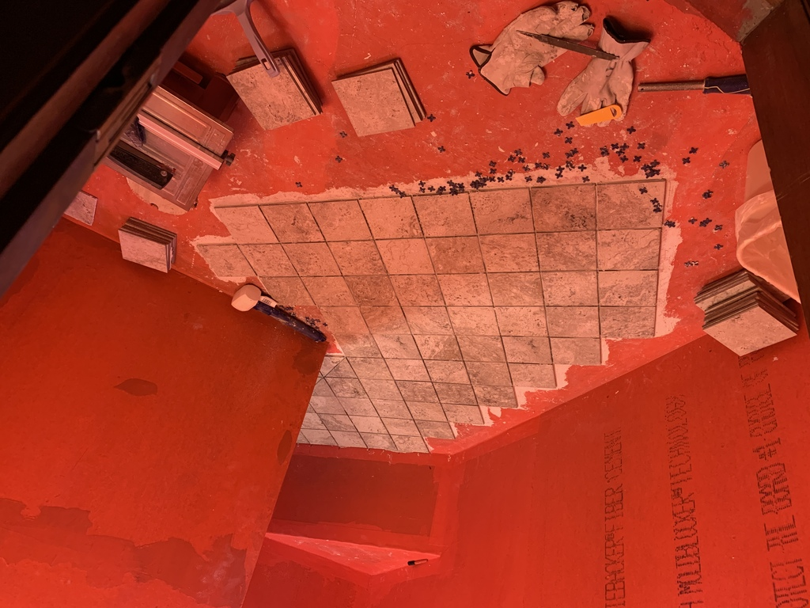

So many tiles...

### More floor - 9th April
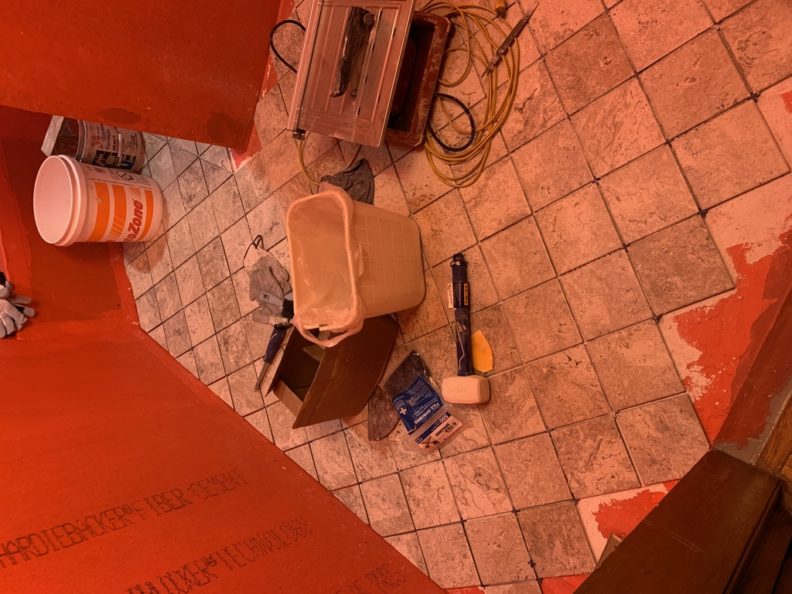

### Tiling the Bench - 2nd May to 4th May

### Laying Wall Tile - 30 April to 31 May

### Shower Cubby - 11 May

### Continuing With Wall Tile ...
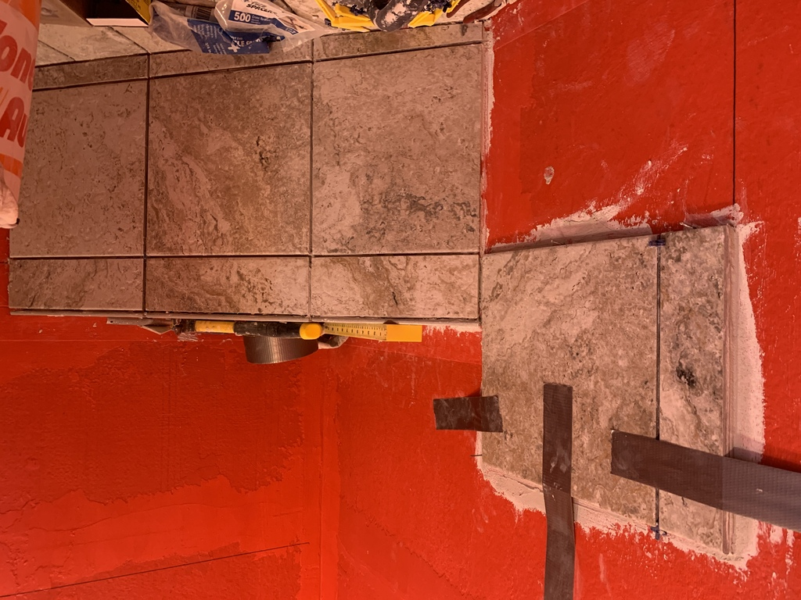

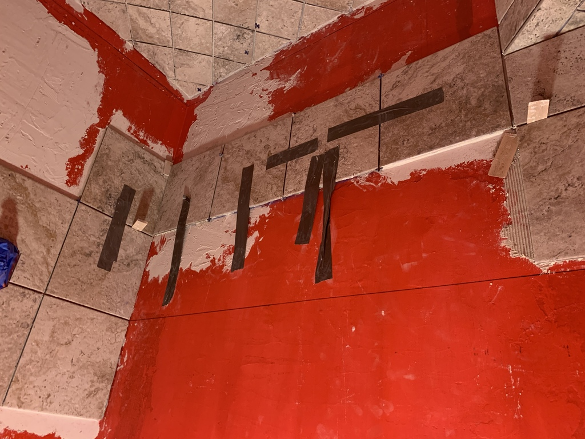

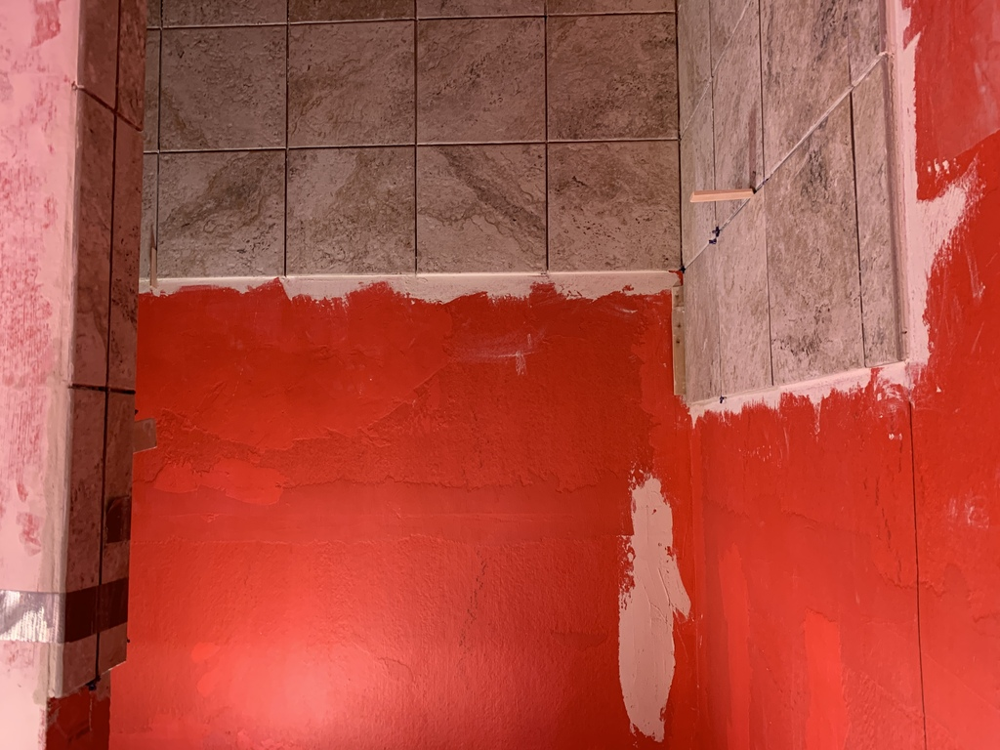

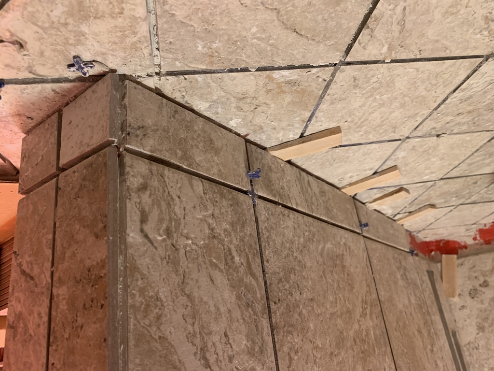
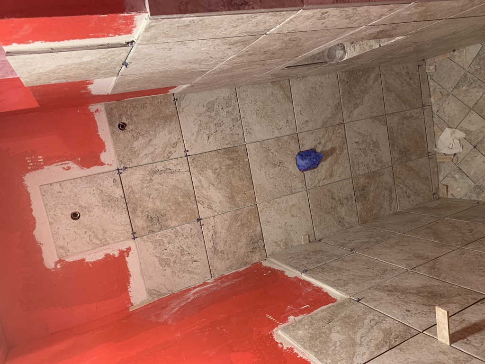

### Oops - How to Break and Fix a Tile - 22 May

Careful work with a cold chisel is required, but it's not too bad.

### Back To Wall Tile ...

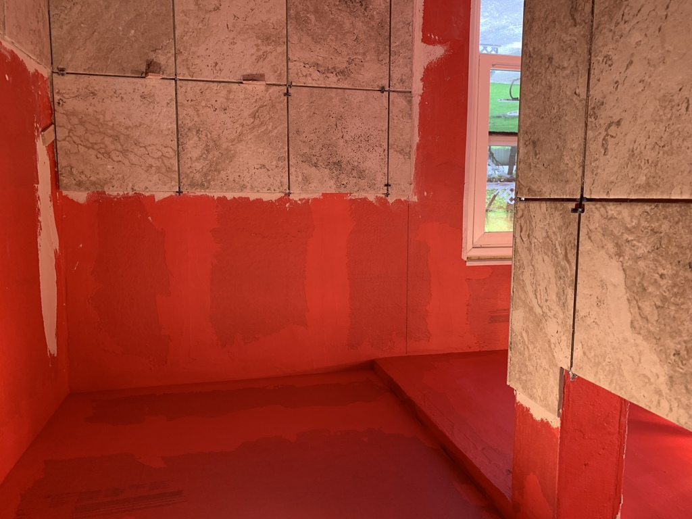

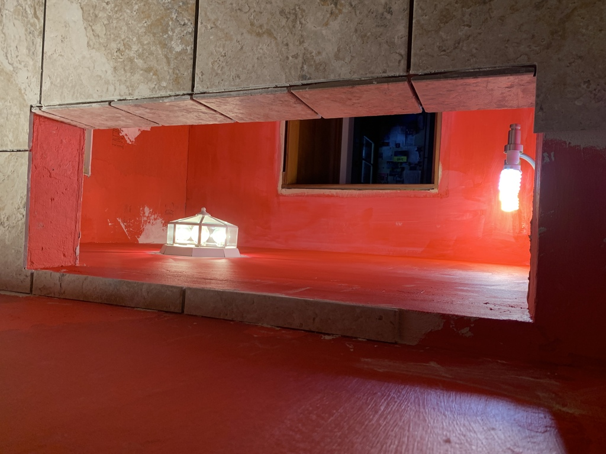

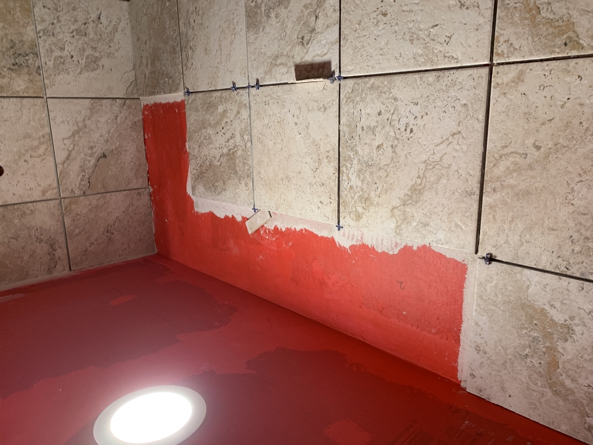

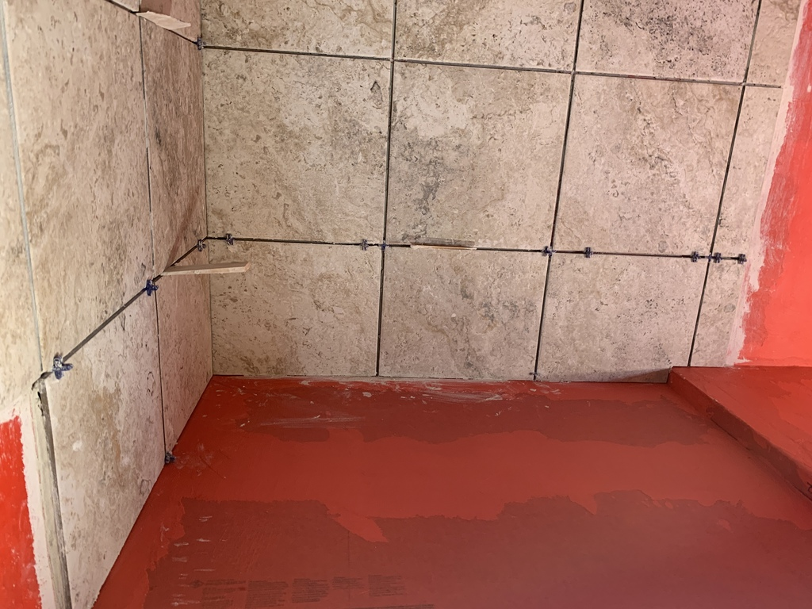

Finished tiling two months to the day after I started.  433 full or partial tiles laid!  It felt almost like I knew each one by name...
