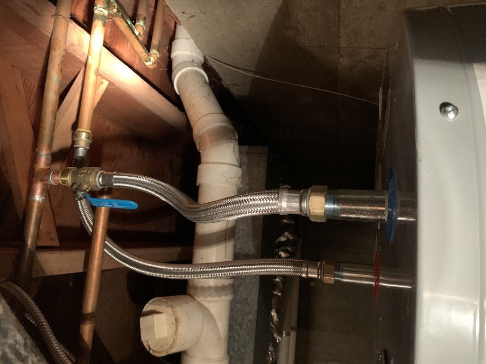

# Dedicated Water Heater

As the first step in upgrading the bathroom, I put a dedicated 20-gallon water heater in the crawl space just below.

In the course of installing the water heater itself, I refactored a lot of hot water piping. I was able to remove a 3/4" hot water line that ran all the way across the house.  That line had been added when the attached garage at the end of the house was converted to a master bedroom and bathroom.

It took a looong time to get hot water to the bathroom, and wasted lots of hot water in the process.

I also removed a bunch of unused pipe that had been left in place from previous projects. -->

It was an interesting exercise re-attaching not only the dishwasher line but also the humidifier tap (I didn't realize at first that the humidier was being fed *hot* water, but it makes sense; hot water evaporates more quickly).  I discovered the SharkBite fittings, which are expensive but awesome, especially where (a) you can't easily sweat a copper joint without setting something on fire, or (b) you might need to disconnect the pipe later for whatever reason.  In the latter case, the SharkBite fitting on the water heater's hot water line came in handy when I discovered the humidifier requirement; I popped off the fitting, added a tee, and popped it back onto the bottom of the tee:

Feeding the humidifier from a nearby water heater saves energy; the humidifier is more effective since it's getting hotter water.  Water trickles into the humidifier, and by the time it reached the humidifier from the far-off main water heater, it was merely warm.

As part of running power to the water heater, I also fixed an ancient wiring mess providing power to the oven.

 
  

    
From this (note the extension cord 😮)... 

    
  

  

    
 ...to this: 

    
  

