# Ceiling and Light

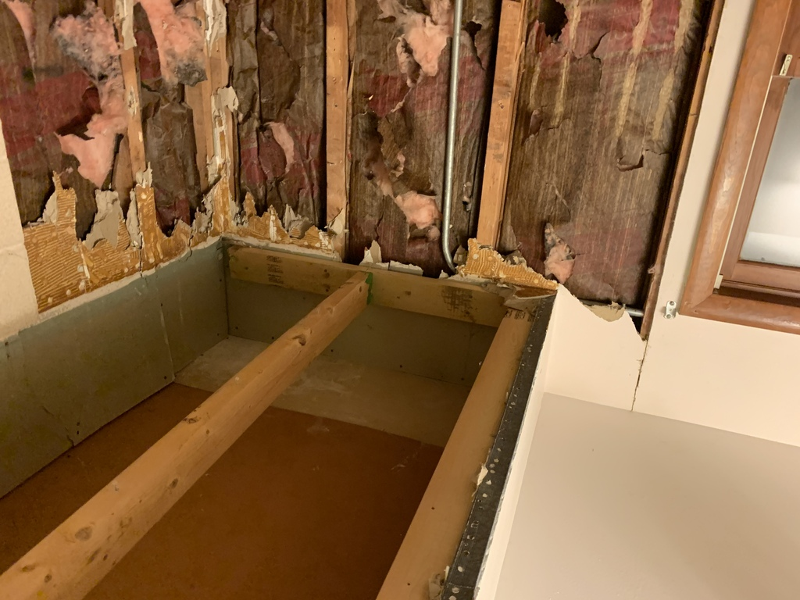
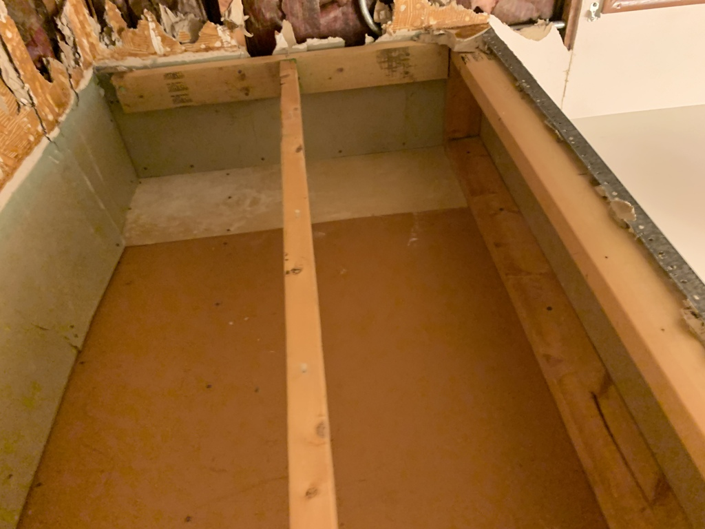
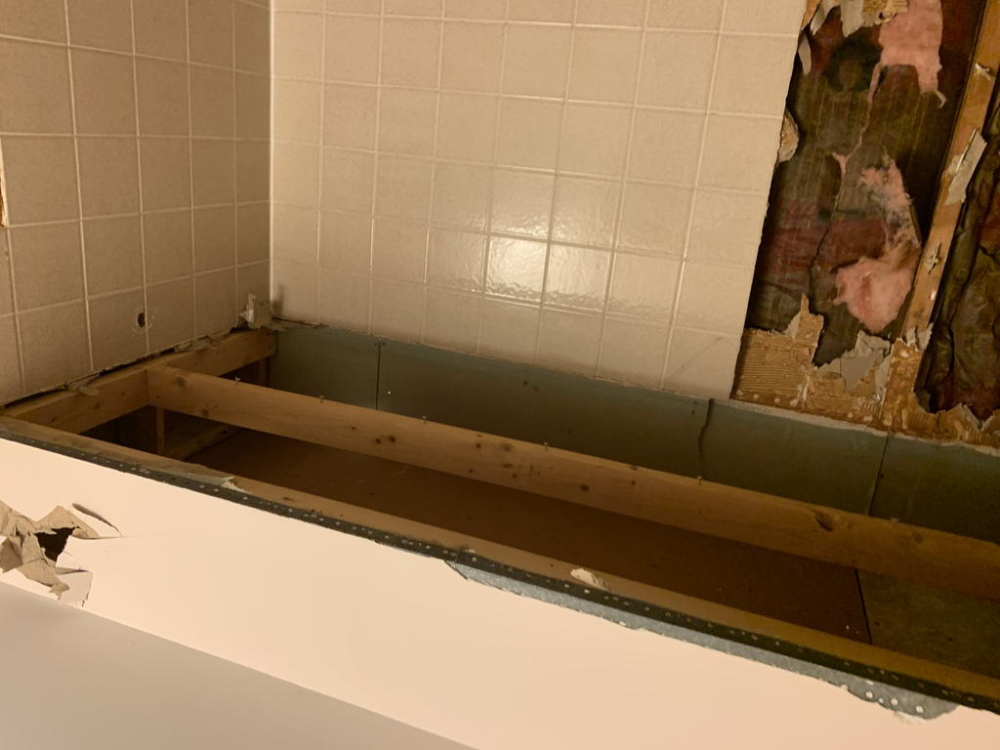
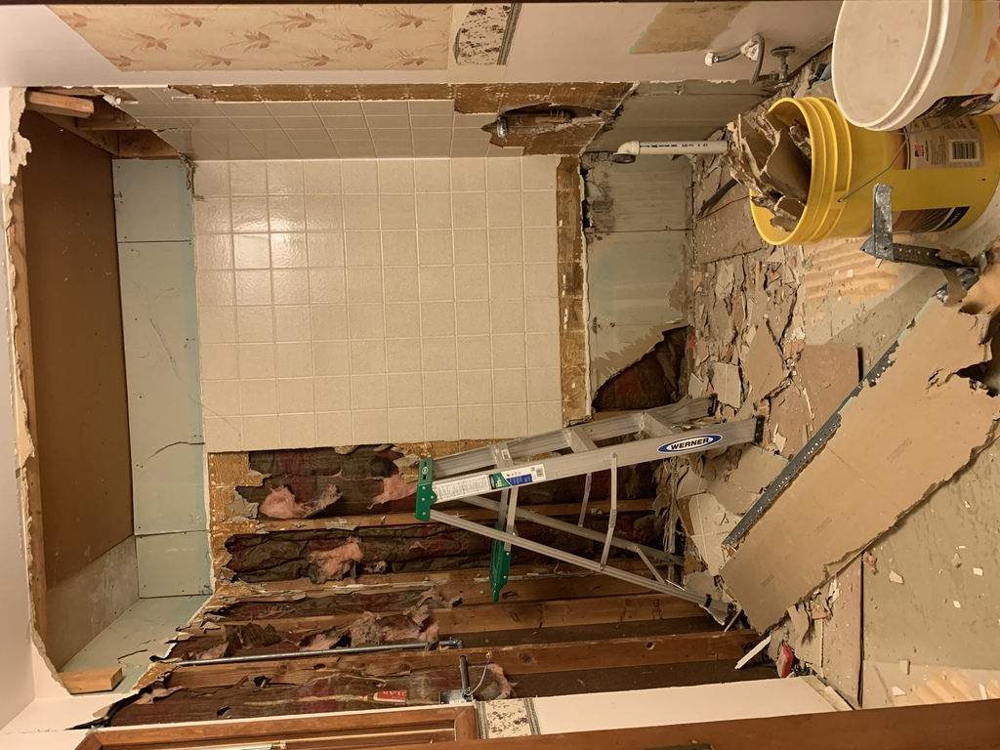

Taking out the ceiling box

&nbsp;

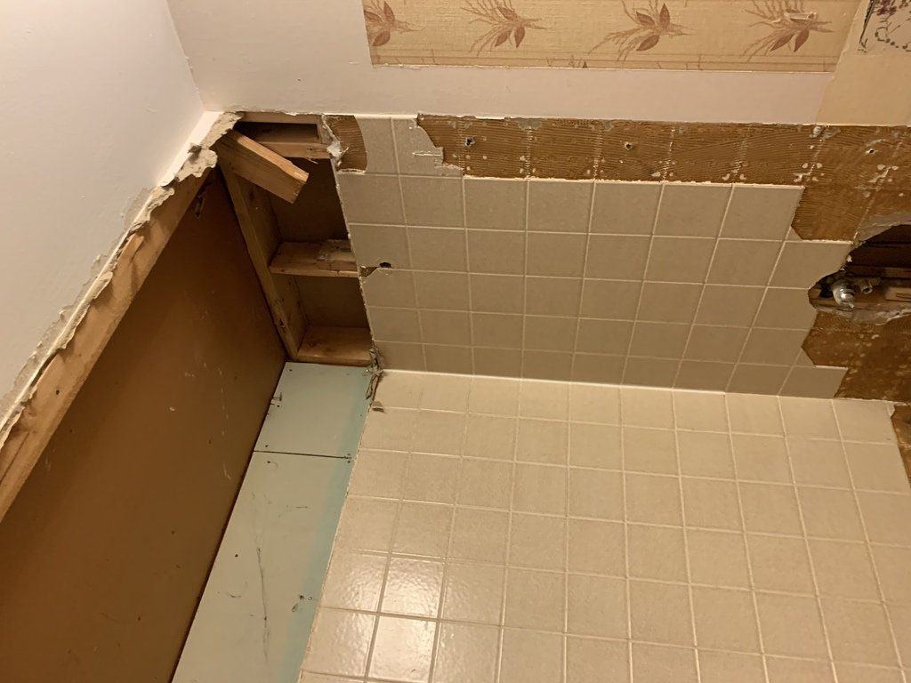
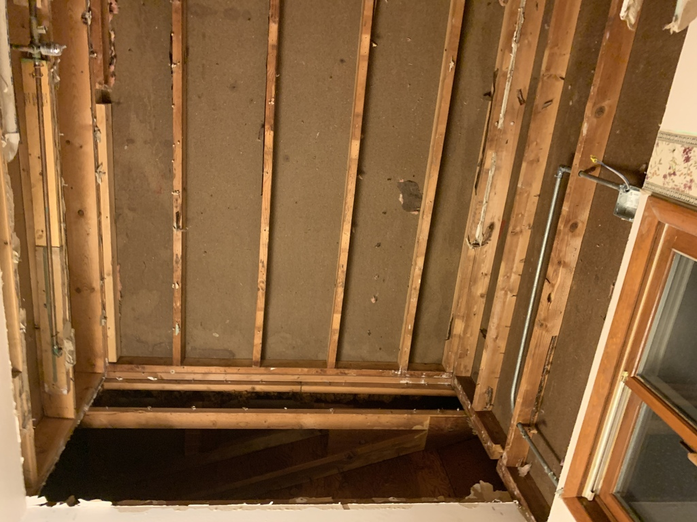

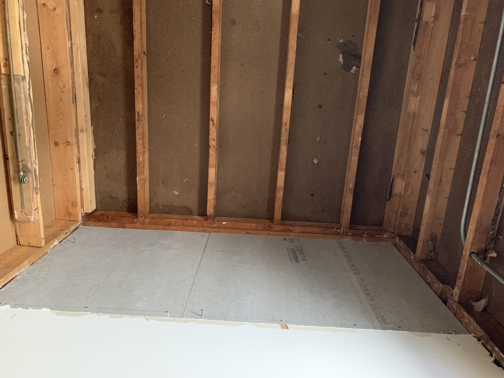

Trial install of ceiling - cement backer board

&nbsp;

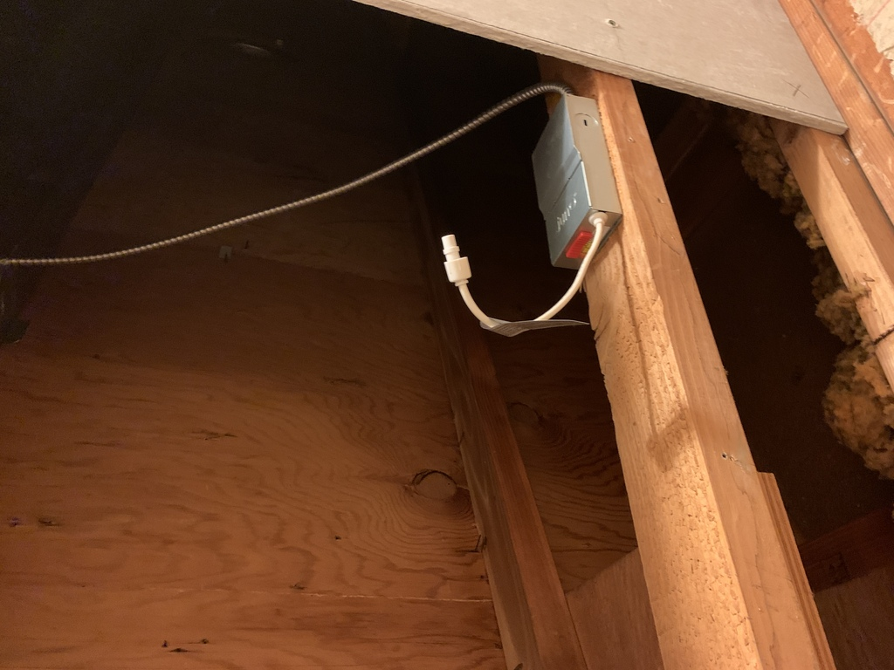

Shower-rated LED lighting

&nbsp;

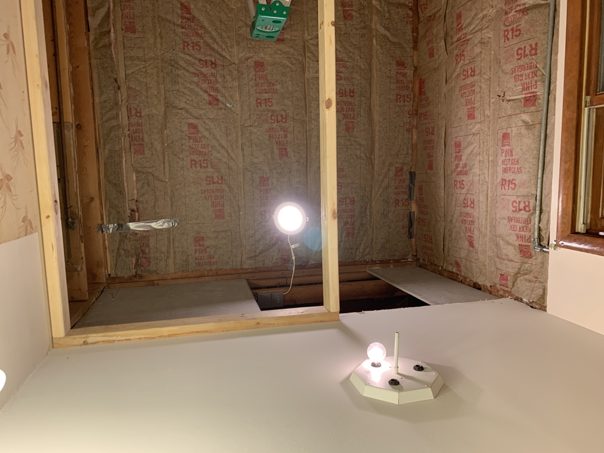
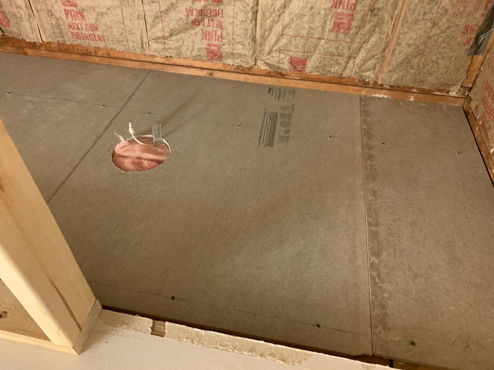
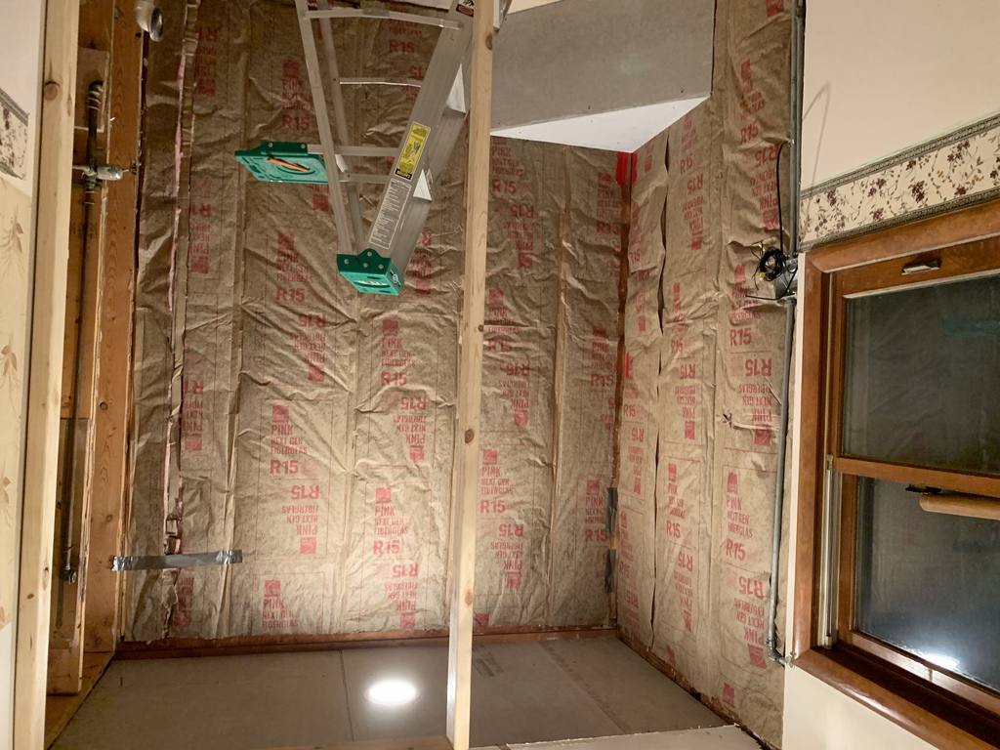
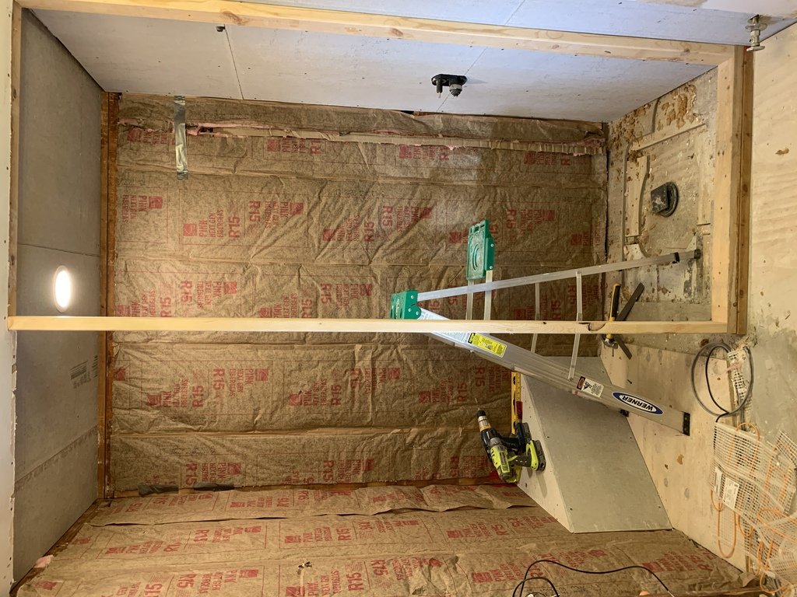
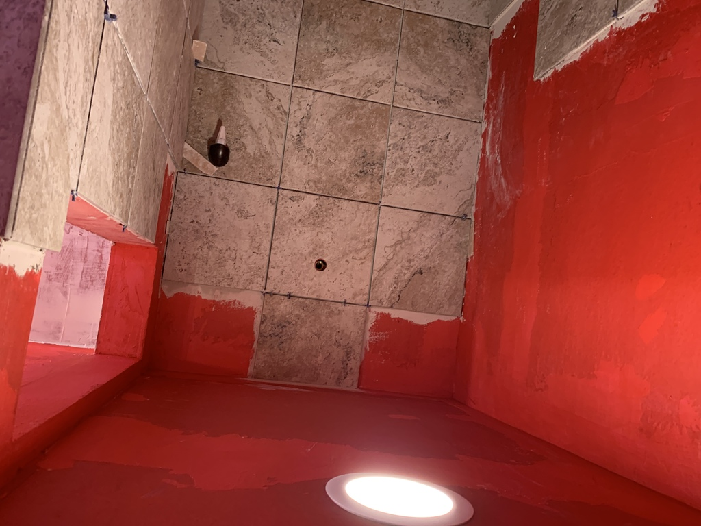

&nbsp;

The finished shower ceiling. If I were to do it over I would drop it a couple inches, flush with the rest of the bathroom ceiling.  But overall, I like how it turned out.
