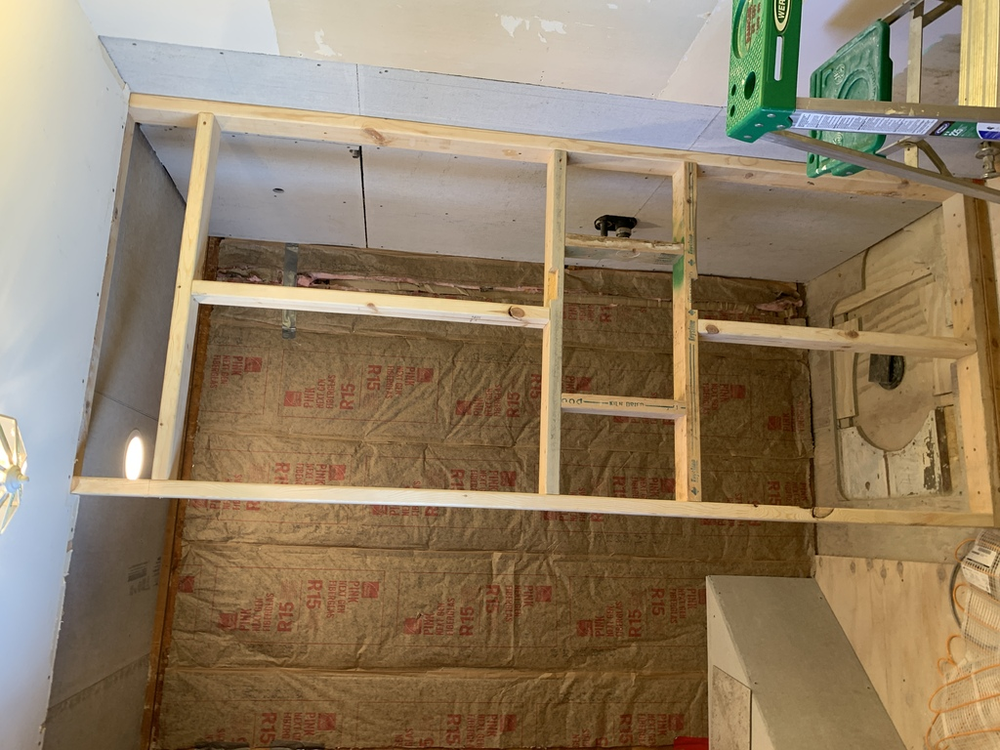

# Shower Cubbyhole

Before tiling the cubby, I sealed the edges with seam tape and redgard.

I planned the wall tile around the cubby so that the cubby top and side tiles fit behind the wall tile, and the cubby shelf overlaps the bottom wall tile.

I really like how the shower cubby tile turned out.  I wasn't sure how I'd tile the cubby right up until I started piecing it in.  I did the wall tile around it first, and then I tried a shelf piece at the bottom right that just happened to line up with the seam.  At that point, I realized it would work beautifully to continue the vertical line right up the back of the cubby.

I tiled the cubby from bottom to top, the cubby floor having a very slight slope toward the shower.

