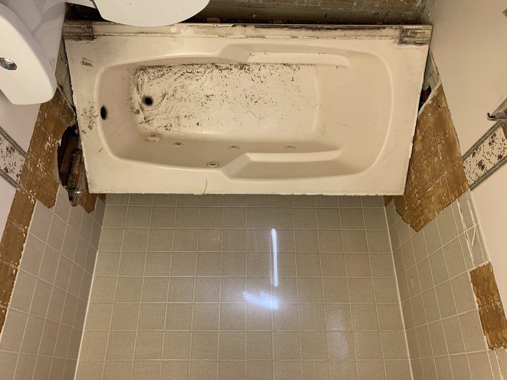
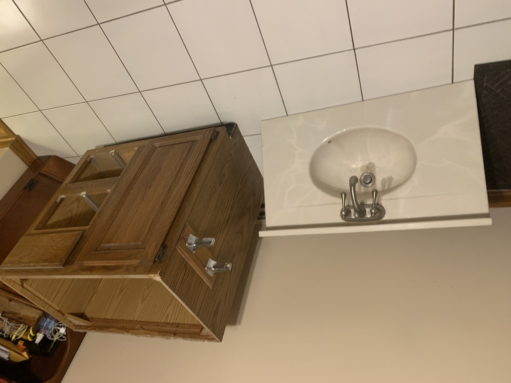
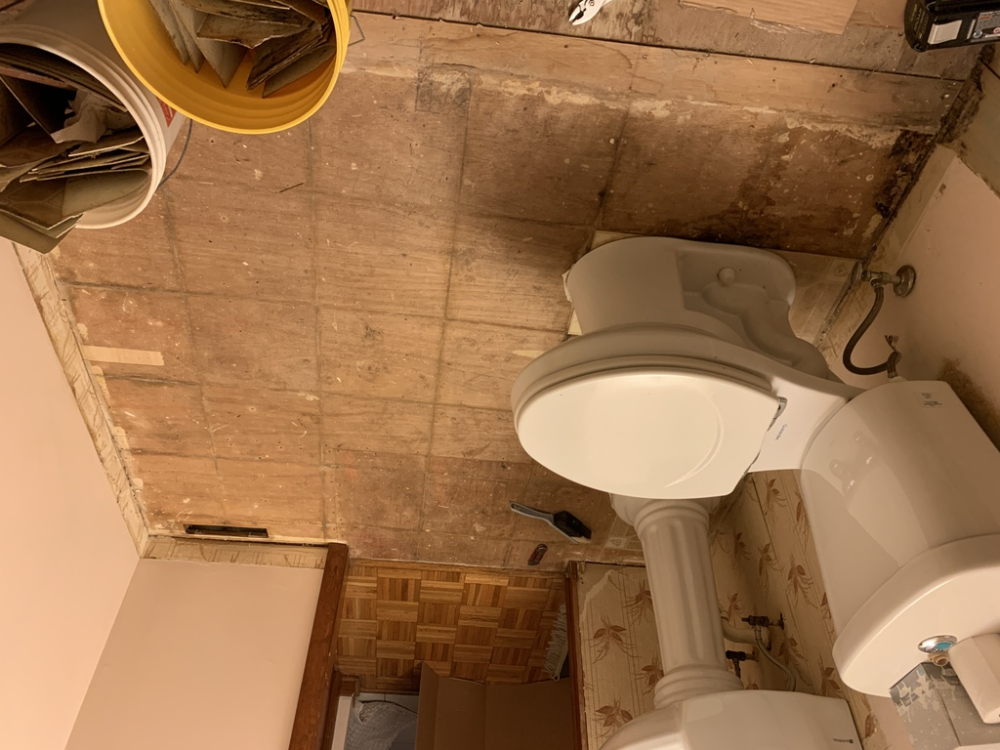
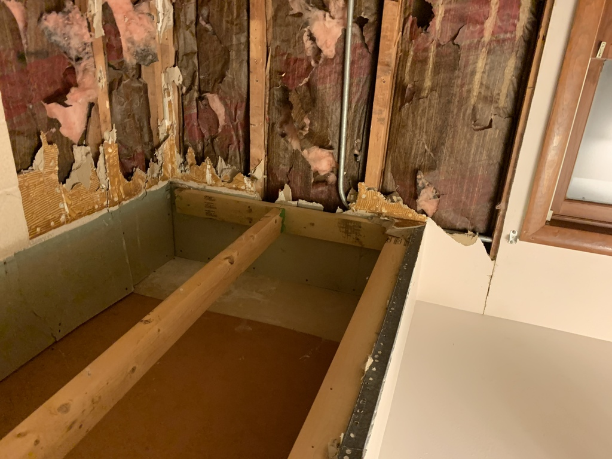
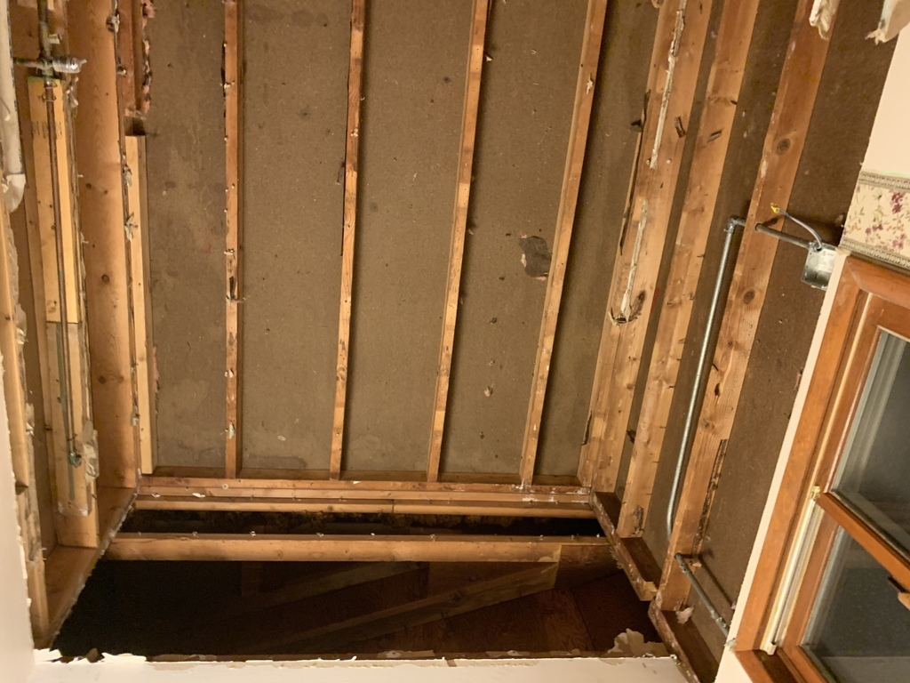
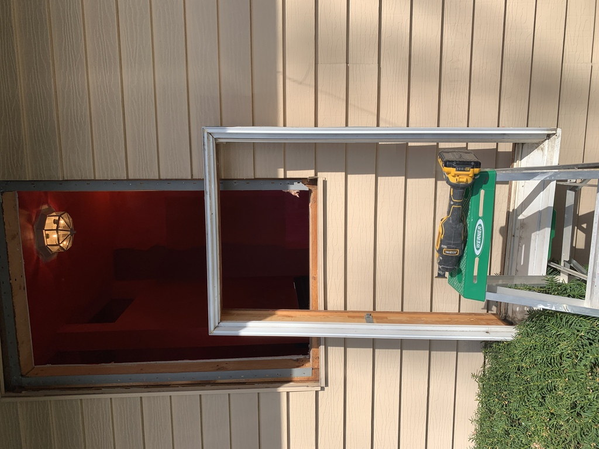

# Demolition

While Grace was out of town, I took the plunge...

I had already bought the new sink.  I put it in temporarily while taking out the linoleum floor.

&nbsp;

Taking out the window, 'way later on.  The new window is leaning against the wall, inside.

One of the trickiest bits was figuring out, without destroying the siding, how the old window was installed.  It turned out OK, once I discovered the old window used flanges.

The oscillating saw was very handy here and elsewhere.
