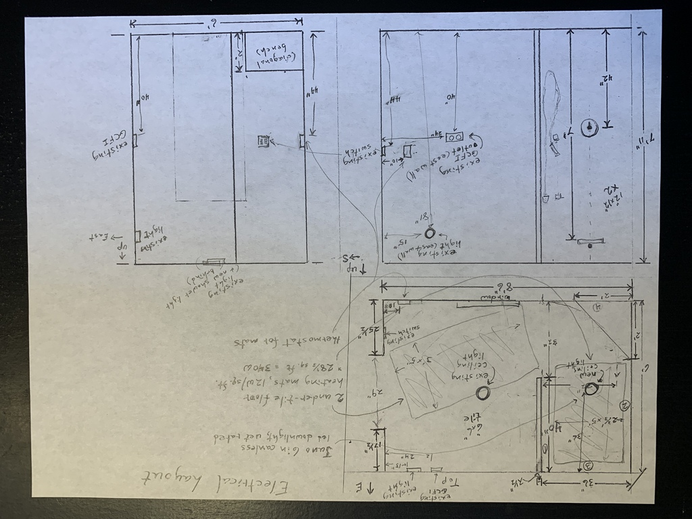

# Design

## Utility

Here is the old bathroom.

  The bathroom before starting renovation

We weren't using the jacuzzi any more.  The openings accumulated black mold.

The old tub and shower was difficult to keep clean. The glass doors required frequent cleaning, and the caulk around the tub mildewed and needed to be replaced occasionally--an arduous, time-consuming and messy job. 

The bathroom was **cold**.  Being converted from a garage, it was at the far end of the house from the furnace.  The window was single-pane uninsulated glass, which made it worse.

## Use of space

The jacuzzi tub took up a lot of space. 

The ceiling box above the tub--presumably for concentrating steam inside the shower space--made an already small room even smaller.

The vanity and cabinet were too large for the space.

## Safety
The inside of the tub was slippery and slanted.  The glass door track was sharp, making it dangerous to get in and out of the shower.

The window lock didn't work.  The counterbalance was broken, so that the window didn't stay up on its own.

## Decor

The vanity was dated.  The cabinet was likely a repurposed kitchen cabinet.  The linoleum floor was old and peeling.

## Wish List

### Walk-in shower, wheelchair-accessible
A walk-in shower means less to trip over--important as we get older!  Grace wanted a vent at the top, to allow steam to escape more easily.  For wheelchair access, the shower entrance needed to be 30 inches wide.  I wanted to avoid thresholds if possible.  They tend to need fixing, accumulate dirt, and make a tripping hazard.

### Roman travertine-style tile
Travisano Trevi tile by Marazzi inspired by Megan's walk-in shower, with 3/16" spacing.  The pattern and spacing work well together, and 3/16" is forgiving to a newbie tile guy.

### Heated tile floor
I wanted to change the character of the bathroom to be warm and inviting.  My Uncle Bob had put in a heated basement floor when building his house outside Petersburg; it was so nice to walk on!  A heated floor would go a long way toward making it a desirable place.

### Conserving water
A Delta shower valve and trim with flow control and temperature control, combined with a rain showerhead, makes it easy to use only the water you need.  Additionally, a hand shower would be usable as a bidet--something Grace liked when staying in London while visiting Lydia--and save even more water.

### Corner bench
Mom's corner bench in her new walk-in shower is useful. I wanted to make ours a little lower and a little wider.

### A calming, uncluttered space
The old bathroom was a busy, jarring set of patterns that did not go well together.  I wanted a peaceful cohesive design, uncluttered but not stark.

### New Window
The new window would be well-insulated, cleanable from inside, with panes allowing it to be opened at the bottom or top.

### Lighting
A light in the shower itself helps make it welcoming.  With a narrower frame, a new window would also let in more light.

### A big sink with plenty of depth
Sometimes I like to use the sink to wash my hair.  The small sink did not lend itself to such practices.

## Challenges
- Getting the shower drain right.  Lots of engineering goes into a well-installed drain!
- Building and anchoring the shower wall, since it wouldn't sit directly under a rafter.
- Waterproofing the shower.  Standard drywall is not rated for shower walls, and waterproofing requires extra work and material.
- Embedding the heating elements in the floor, and wiring them to the thermostat.
- Wiring the shower light from the attic.
- Learning to tile and grout.
- Learning to replace a window.

