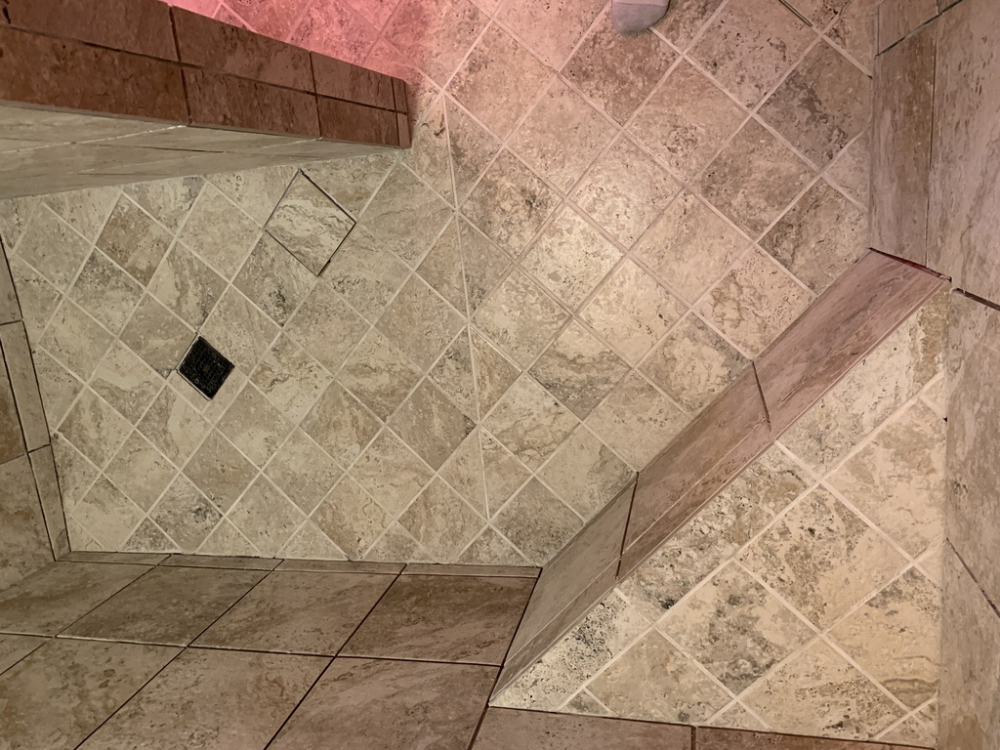

# Grouting

Prototyping a dark "Coffee Bean" grout...Nope.

The light colored is looking much better. Polyblend Plus non-sanded, #386 Oyster Gray.  (Pay no attention to reddish hue, it's the RedGard all over the walls and ceiling).

Shower floor and bench grouted.  (The not-grouted floor tile is where I replaced a chipped tile).

Hole for the shower pipe.
