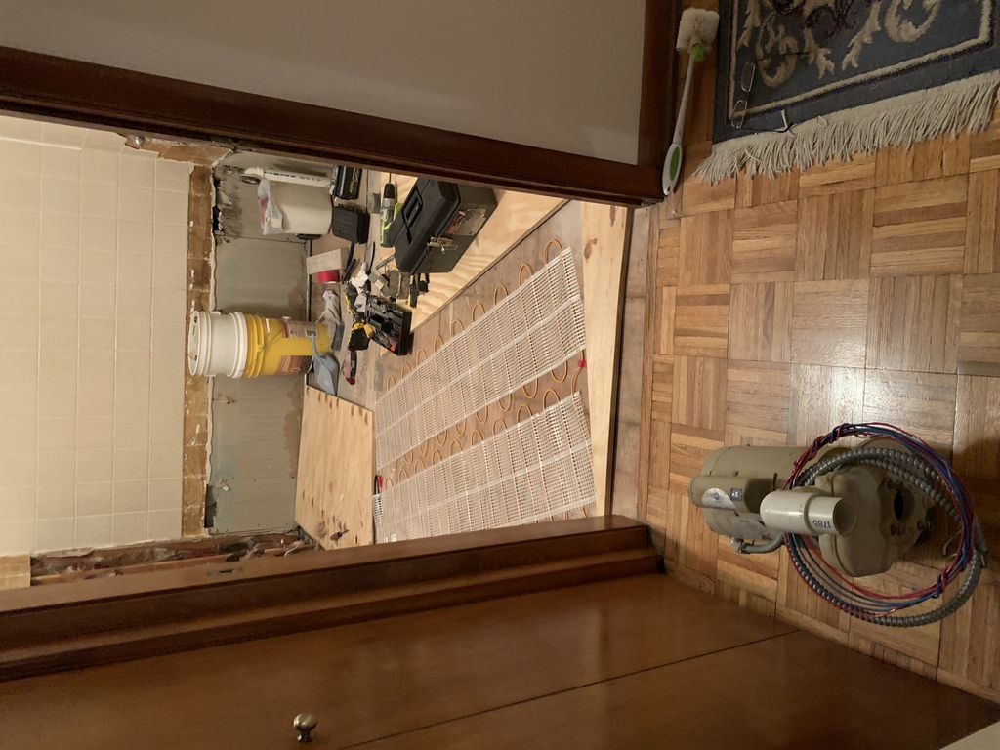
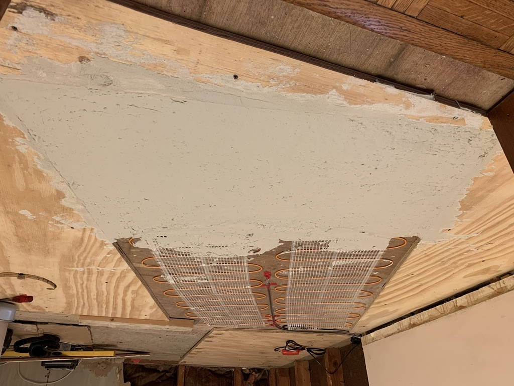
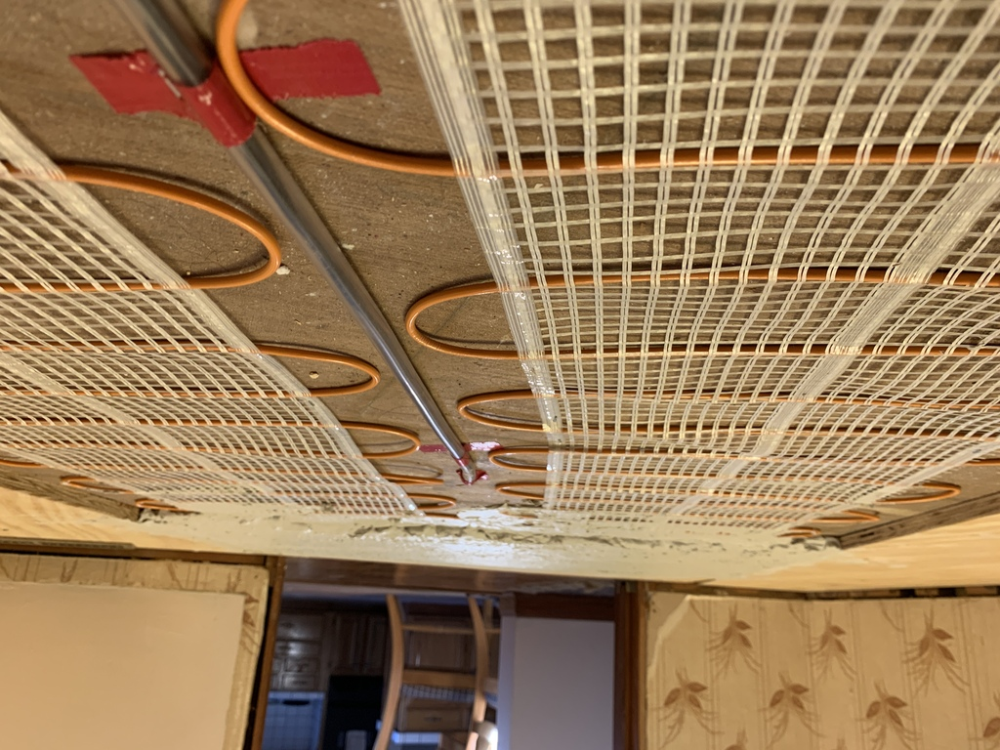
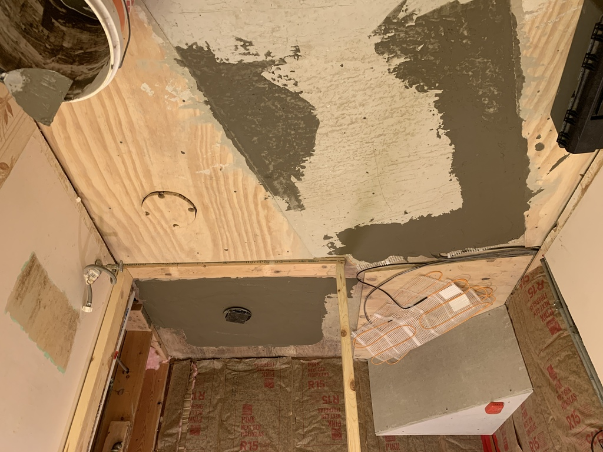
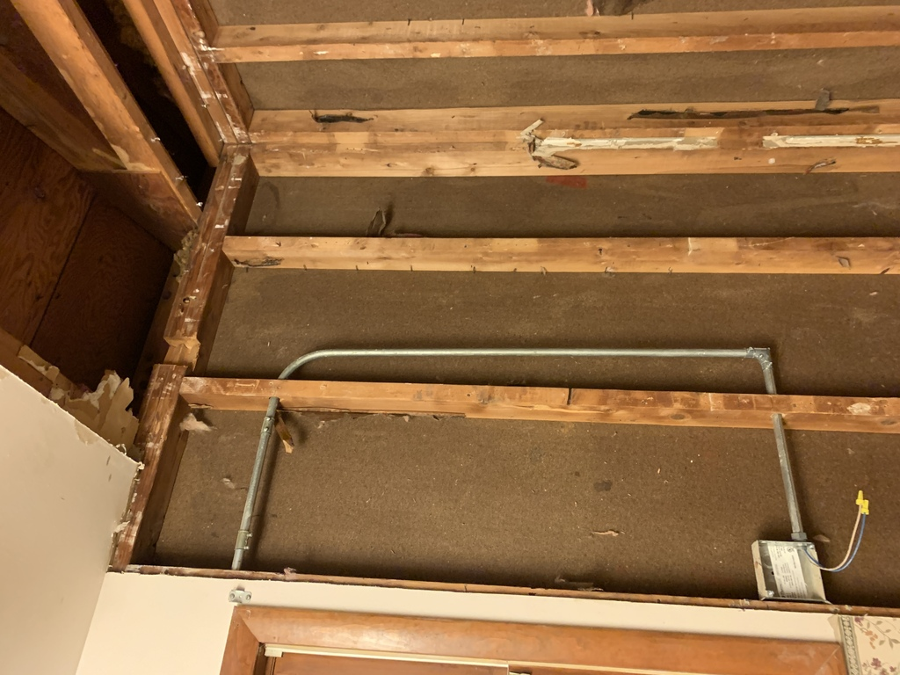

# Heated Floor
I decided on ThermoSoft resistance heat pads, one in front of the toilet and sink, and one in the shower.  They needed to be buried in the floor, so I raised the floor around the pads using 3/4" plywood.  Total cost of pads, thermostat and sensors: about $600.

With the plywood in place, I could start covering up the pads.

For the shower floor, I first needed to float the right slope, while leaving enough margin to cover the heating pad.

I initially installed the thermostat too close to the shower; it wouldn't have passed inspection.  I had to move it.

This was better. (It's where the timer box for the jacuzzi was.  Now I know why they put it way over there!)

