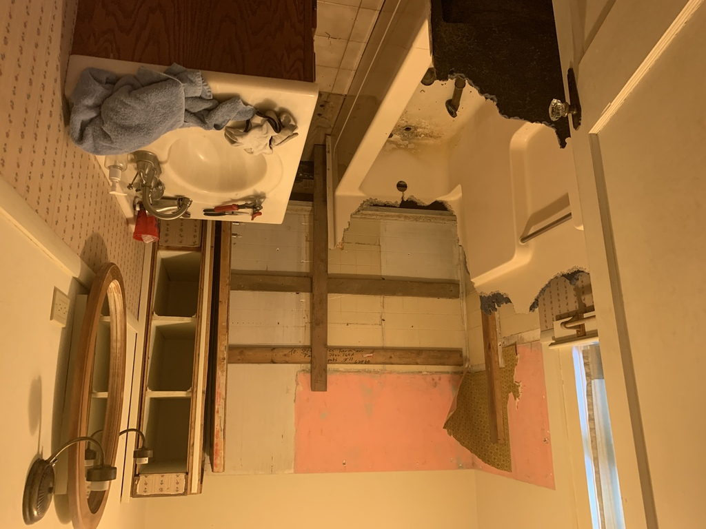
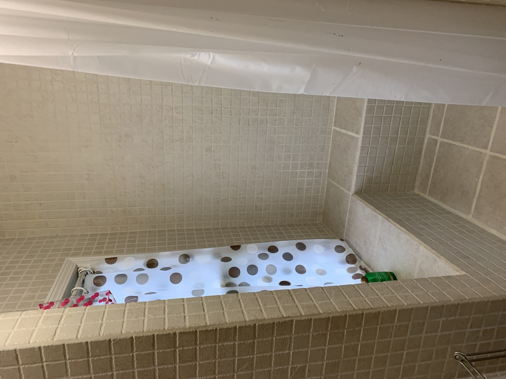
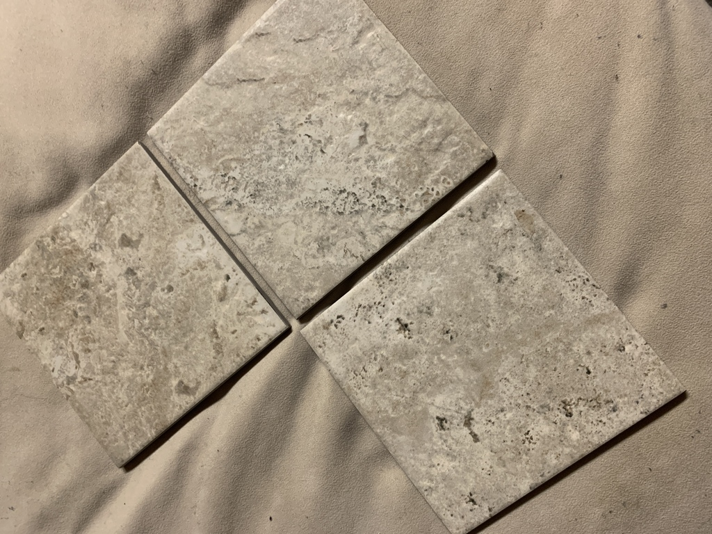

# Inspiration

During a 2021 Brauer reunion in Southern Illinos at the end of August, a relative who came to stay at Mom's house broke off the rain-head showerhead while trying to adjust it.  When I took a look and told Mom it needed some "deep fixing" (the plastic pipe was broken off behind the shower), she asked Why not just redo the whole shower?  In mid-September, I did the demo, taking out the fiberglass tub/shower.

Mom had a local handyman put in a walk-in shower with custom tile, getting it done shortly before Thanksgiving.  Parts of it were inspired by Uncle Rich's DIY shower at his house by Lake Petersburg.  When I saw Mom's shower, I came away thinking that (a) it looked pretty good, and b) I was sure I could do better.

In early October, I went ahead and put in a dedicated water heater (more on that later), as a prelude to the bathroom work.

  Demo'ing Mom's downstairs bathroom, Septembrer 2021

When I stayed over at Jim and Megan's house, I took a look at their bathroom, and loved the Roman-style textured light tile that they used. I liked the bench, the wide grout spacing, and the large tiles.  I resolved to use something close to it.
  Jim and Megan's bathroom

I eventually found the travertine-style "Travisano Trevi" tile at Home Depot.  In turn, that pattern guided me to further Roman-style choices expressing a simple, uncluttered, calm theme.

