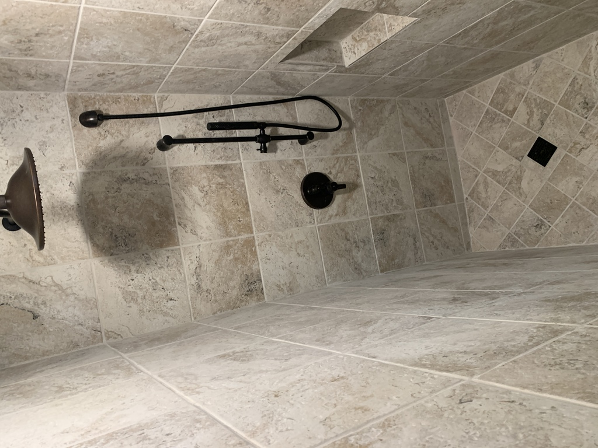

# My DIY Bathroom Renovation

In January 2022, I finally tackled a project that had been on my mind for awhile: redoing our master bathroom.  It took me six months, and was more involved than I expected (how many DIY'ers have said that before 🤔).  By the time it was done, I was really ready to do something else with my evenings and weekends.

<!--more-->

With all that said, it turned out GREAT.  I couldn't be more pleased with the results.  It's so much more functional, efficient, safe, easy to clean.  I love its peace-inducing aesthetics.  

During those six months, I did design, demolition, plumbing, electrical, carpentry, drywall, waterproofing, tiling, painting, insulation, window replacement.  I am fortunate to have friends in the trades who guided me through the electrical and plumbing bits especially.  My brother loaned me his tile saw.  I am also fortunate that Lisle supports DYI'ers by allowing them to act as their own contractors for plumbing and electrical (Downers Grove, for instance, does not allow that).

