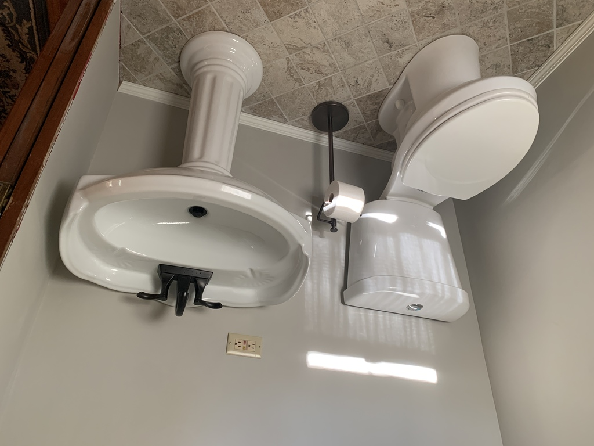

# Painting and Trim

My friend Bob, with decades of construction experience, shared valuable insight.
> Do your best, and caulk the rest

Also...

> Caulk and paint make a carpenter what he aint

He also taught me the three phases of construction project management:
1. The design phase
1. The build phase
1. The lawsuit phase

The prepainted real wood is more expensive, but I think it looks better.

Getting the trim corners "good enough" required a few trips back and forth to the chop saw.

<!--  -->

Painting the bathroom side of the slot door completed the atmosphere, setting the room off from the rest of the house and creating a light, calm and uncluttered space.

