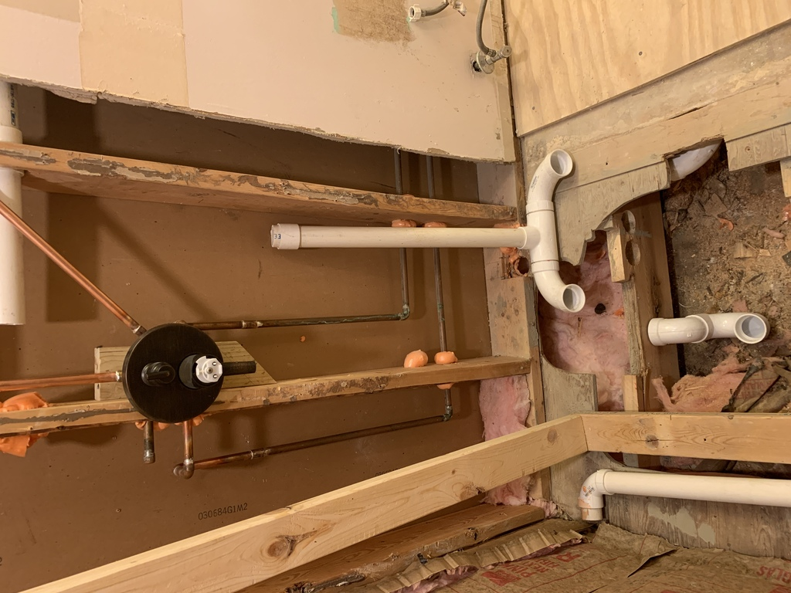

# Shower Valve Plumbing

The fireblock foam is required by code.

For the hand shower pipe, I fastened it a couple feet below the elbow, in order to leave some wiggle room in case I needed to pull it forward for tile clearance, but also keep it snug against the tile.  In fact, this is exactly what happened.

Notice from the pic on the left that I had forgotten to put in water hammer arrestors.  There were some by the sink originally, but now they're gone, so these are extra-necessary.

 13 Feb 2022 - Everything shower-plumbing-related pretty much in place and ready for rough plumbing inspection.
