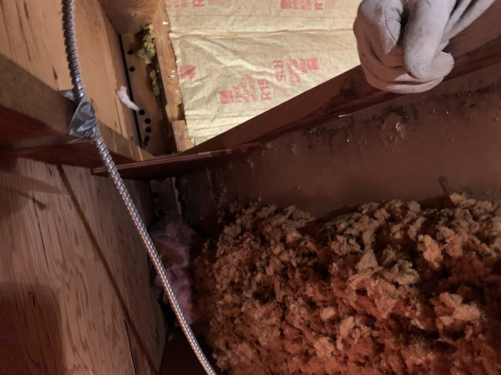
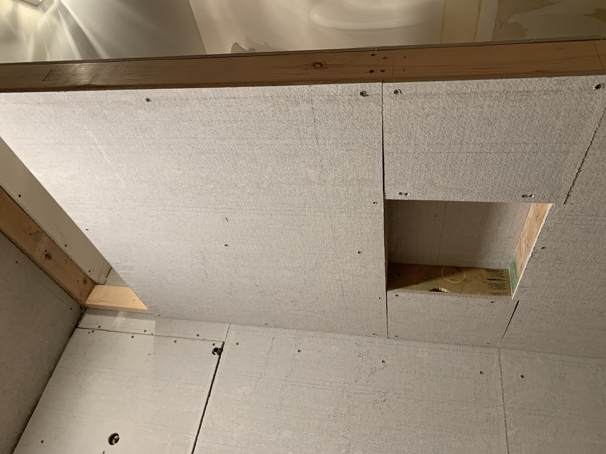
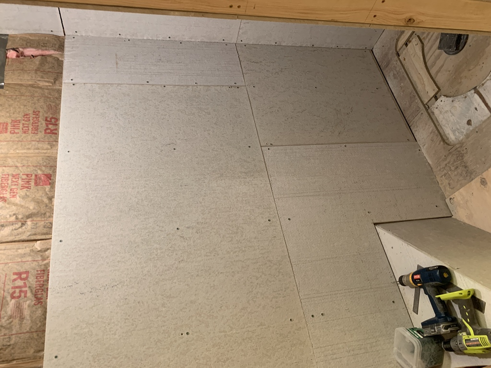
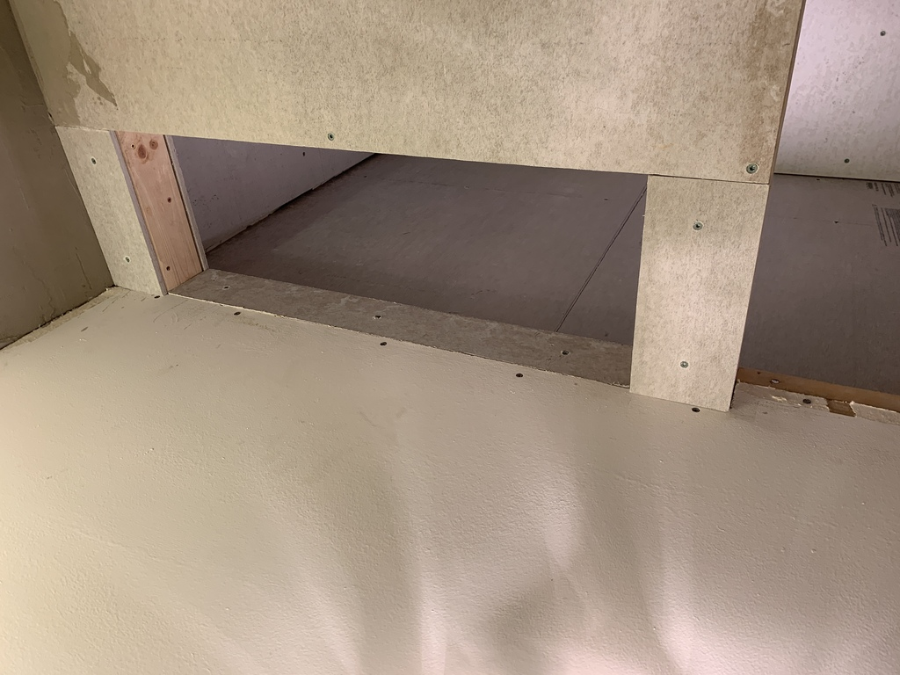

# Walls and Insulation

As I went along, it became clear that much of the insulation would need replacing.

I initially brought home some MoldTough green drywall, but then discovered that it isn't rated for showers.  So I took back the 5 4x8 sheets, and went with 0.42" "HardieBoard" cement backer board, which comes in 3x5' (due to its weight, no doubt).

Insulation started going in on 19 Jan.

Wallboard started a month later, 20 Feb.  I needed to do the plumbing and wiring, and have the rough inspection done first.

<video width="32%" controls>
  <source src="images/IMG_4003-480p.mov">
</video>

Pre-inspection movie for Rick's plumber friend

I sistered a 2x6 along a rafter, in order to anchor the top of the wall where I wanted it to go.

The height difference between the shower ceiling and the rest of the bathroom was an issue.  I resolved it by adding a 2x2 after putting up the rest of the backer board.

Grace asked for the steam vent.

