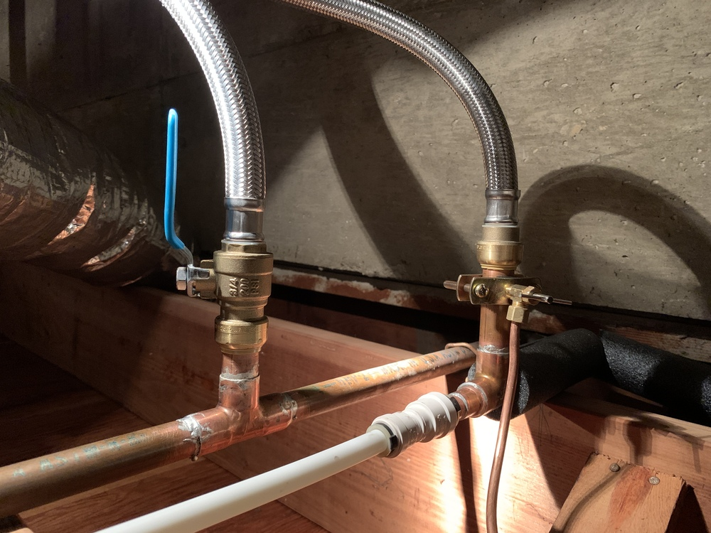

# Dedicated Water Heater

As the first step in upgrading the bathroom, I put a dedicated 20-gallon water heater in the crawl space just below and next to the room.

Along the way, I refactored a lot of piping. I removed a 3/4" hot water line running all the way across the house, which had been added when the attached garage at the north end of the house was converted to a master bedroom and bathroom.  It was taking a looong time to get hot water to the bathroom, and wasted lots of hot water in the process.

I also removed a bunch of unused pipe that had been left in place from previous projects. -->

It was an interesting exercise re-attaching the dishwasher line and the humidifier line. I didn't realize at first that the humidier was being fed *hot* water, although it makes sense; hot water evaporates more quickly, which is more efficient.  I discovered SharkBite fittings, expensive but awesome, especially where (a) one can't easily sweat a copper joint without setting something on fire, or (b) one might need to disconnect the pipe later for whatever reason. 

In the latter case, a SharkBite fitting on the water heater's hot water line came in handy when I discovered the humidifier requirement; I popped off the fitting, added a tee, and popped it back onto the bottom of the tee:

 
 

    
 Before the humidier fitting... 

   
 

 

    
...and after 

   
 

Note that the tee isn't only for the humidier.  The humidifier actually taps into the line via a saddle valve.  The additional plastic quick-coupling fitting (not Shark-Bite) goes to the dishwasher.

Feeding the humidifier from a nearby hot water source saves energy, and the humidifier is more effective since it's getting hotter water.  Previously, by the time the trickle of water reached the humidifier from the far-off main water heater, it was merely warm at best.

While running power to the water heater, I also fixed an ancient wiring mess to the oven.

 
  

    
From this (note the extension cord 😮)... 

    
  

  

    
 ...to this: 

    
  

