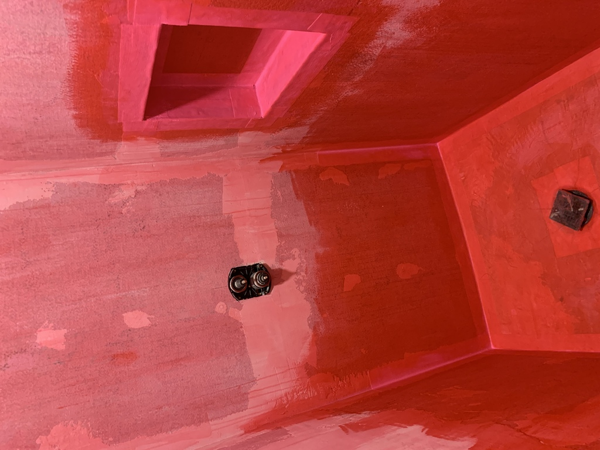
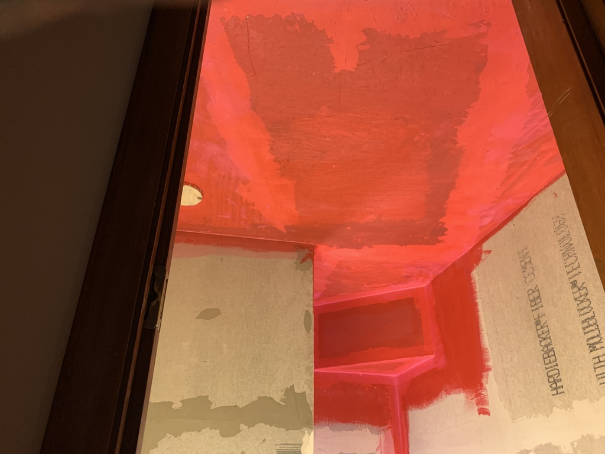
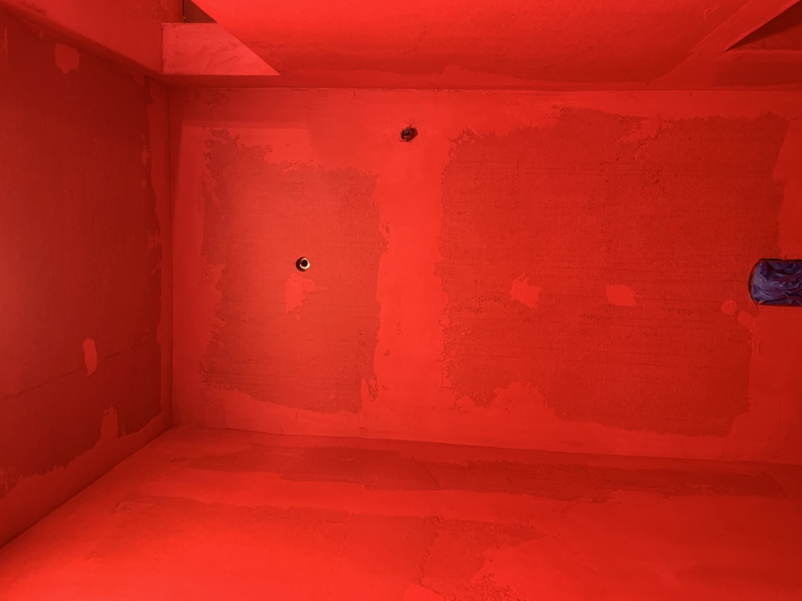
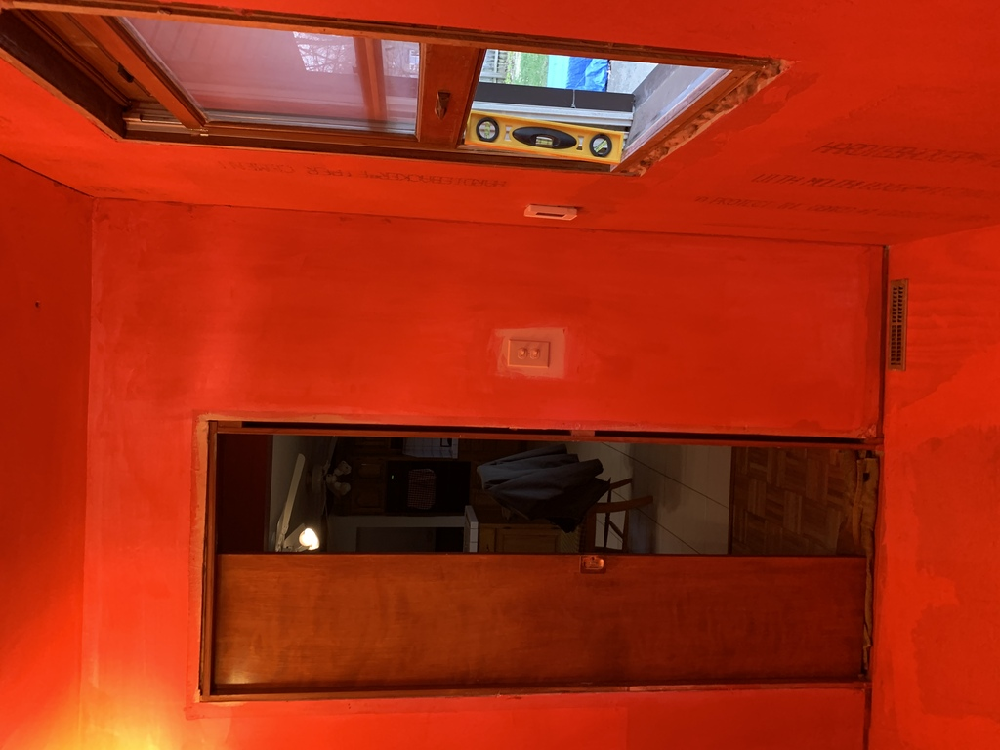
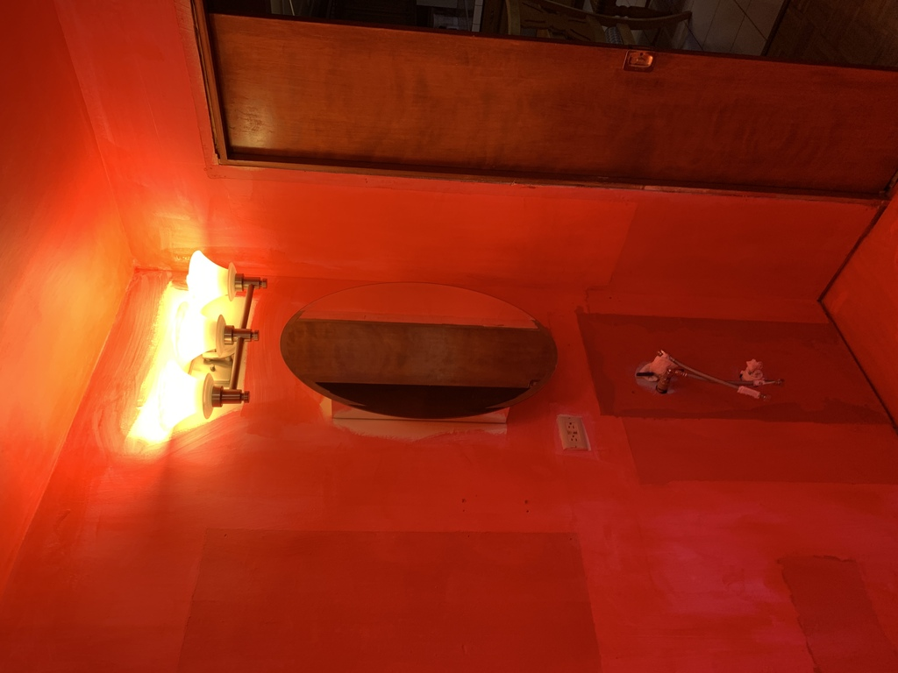

# Waterproofing

### Started 26 March 2022

5" waterproofing seam tape around the shower drain and all corners.  Triple-coat RedGard on the shower floor and 18" up the wall.

Seam tape around the shower cubby corners.

### Getting the Drain Waterproofing Right
Very important to seal the floor around the drain, all the way over the edge of the drain base, so that water can only go down the drain, even if it gets thru the grout and underneath the tile.

I screwed the drain flange bolts partially in and taped the heads, so the RedGard wouldn't foul the threads.

Fastening the flange down over the waterproofing.  Note the weep channels and weep holes in the flange, to allow water to escape into the drain. 

Floating the final slope into the edge of the drain grate.  The grate is aligned at a 45 degree angle, parallel with the edge of the shower bench.

Note the small gravel (courtesy of Lydia's fish tank supplies😃) embedded in the mortar. Under the lip of the grate, it is loose around the flange, preventing the weep holes from getting plugged with mortar. If any water were to get beneath the tile (the grout is not 100% waterproof), it still has a route to the drain and not the floor.

Didn't need to RedGard the whole thing, but I had 3 gallons, and didn't want to waste it.  Although if I'd known how much trouble it would be to get a smooth surface to paint on top of RedGard, I probably would have thrown the extra RedGard away!

Oh well.  At least the walls have absolutely no chance of steam getting through.
