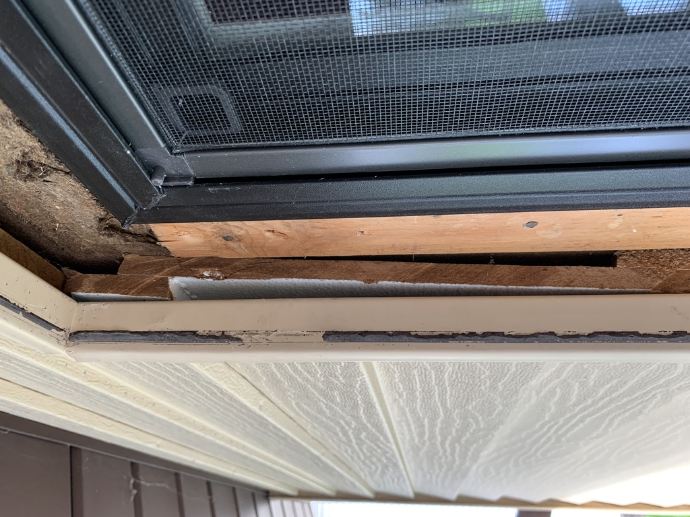

# Windows

A lot of specification goes into a window!

Now that the wallboard and waterproofing is in place, time to tackle the window replacement.  How the heck is the old window fastened in there??  I may want to keep the trim, if I can avoid destroying it while getting the old window out ...

